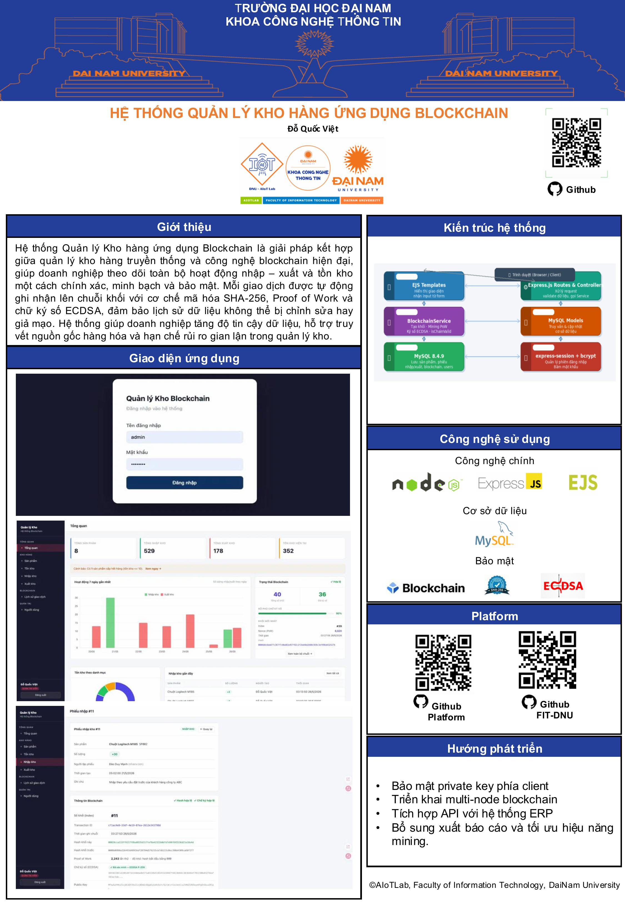

<h2 align="center">
    <a href="https://dainam.edu.vn/vi/khoa-cong-nghe-thong-tin">
    🎓 Faculty of Information Technology (DaiNam University)
    </a>
</h2>
<h2 align="center">
   Hệ thống quản lý kho hàng ứng dụng Blockchain
</h2>
<div align="center">
    <p align="center">
        
        
        
    </p>

[](https://www.facebook.com/DNUAIoTLab)
[](https://dainam.edu.vn/vi/khoa-cong-nghe-thong-tin)
[](https://dainam.edu.vn)

</div>

## Poster!


## 1. Tính năng

- **Xác thực người dùng**: Đăng nhập/đăng xuất với mật khẩu được mã hóa bằng bcrypt
- **Phân quyền**: Hai vai trò `admin` và `user`
- **Quản lý sản phẩm**: Thêm, sửa, xóa, tìm kiếm sản phẩm theo tên/mã/danh mục
- **Nhập kho**: Ghi nhận phiếu nhập hàng
- **Xuất kho**: Ghi nhận phiếu xuất hàng
- **Tồn kho**: Theo dõi số lượng tồn kho theo thời gian thực
- **Quản lý người dùng**: Quản lý tài khoản (chỉ admin)
- **Blockchain**: Mọi giao dịch nhập/xuất kho đều được ghi vào blockchain nội bộ với:
  - Proof of Work (độ khó: 3)
  - Ký số bằng thuật toán ECDSA (P-256)
  - Xác thực toàn vẹn chuỗi khối

## 2. Công nghệ sử dụng

| Thành phần | Công nghệ |
|---|---|
| Runtime | Node.js |
| Web framework | Express 5 |
| Template engine | EJS |
| Database | MySQL (mysql2) |
| Authentication | express-session + bcryptjs |
| Blockchain | Node.js crypto (SHA-256, ECDSA P-256) |
| Environment | dotenv |

## 3. Yêu cầu

- Node.js >= 18
- MySQL >= 8.0

## 4. Cài đặt

### 4.1. Clone repository

```bash
git clone https://github.com/QuocViet1401/warehouse-blockchain.git
cd warehouse-blockchain
```

### 4.2. Cài đặt dependencies

```bash
npm install
```

### 4.3. Cấu hình biến môi trường

Tạo file `.env` ở thư mục gốc:

```env
DB_HOST=localhost
DB_USER=root
DB_PASSWORD=your_password
DB_NAME=warehouse_blockchain
SESSION_SECRET=your_secret_key
PORT=3000
```

### 4.4. Khởi tạo database

Tạo database MySQL và các bảng cần thiết:

```sql
CREATE DATABASE warehouse_blockchain;
USE warehouse_blockchain;

CREATE TABLE users (
    id INT AUTO_INCREMENT PRIMARY KEY,
    username VARCHAR(100) NOT NULL UNIQUE,
    password VARCHAR(255) NOT NULL,
    fullname VARCHAR(255),
    role ENUM('admin', 'user') DEFAULT 'user',
    created_at TIMESTAMP DEFAULT CURRENT_TIMESTAMP
);

CREATE TABLE products (
    id INT AUTO_INCREMENT PRIMARY KEY,
    code VARCHAR(100) NOT NULL UNIQUE,
    name VARCHAR(255) NOT NULL,
    category VARCHAR(100),
    stock INT DEFAULT 0,
    price DECIMAL(15, 2) DEFAULT 0,
    created_at TIMESTAMP DEFAULT CURRENT_TIMESTAMP
);

CREATE TABLE imports (
    id INT AUTO_INCREMENT PRIMARY KEY,
    product_id INT NOT NULL,
    quantity INT NOT NULL,
    note TEXT,
    created_by INT,
    created_at TIMESTAMP DEFAULT CURRENT_TIMESTAMP,
    FOREIGN KEY (product_id) REFERENCES products(id)
);

CREATE TABLE exports (
    id INT AUTO_INCREMENT PRIMARY KEY,
    product_id INT NOT NULL,
    quantity INT NOT NULL,
    note TEXT,
    created_by INT,
    created_at TIMESTAMP DEFAULT CURRENT_TIMESTAMP,
    FOREIGN KEY (product_id) REFERENCES products(id)
);

CREATE TABLE blockchain (
    id INT AUTO_INCREMENT PRIMARY KEY,
    block_index INT NOT NULL,
    timestamp VARCHAR(50),
    data JSON,
    previous_hash VARCHAR(64),
    hash VARCHAR(64),
    nonce INT,
    signature TEXT,
    public_key TEXT,
    created_at TIMESTAMP DEFAULT CURRENT_TIMESTAMP
);
```

### 4.5. Chạy ứng dụng

```bash
npm  run dev
```

Truy cập tại: [http://localhost:3000](http://localhost:3000)

## 5. Cấu trúc thư mục

```
warehouse-blockchain/
├── app.js                  # Entry point
├── package.json
├── .env                    # Biến môi trường (không commit)
├── blockchain/
│   └── Blockchain.js       # Logic blockchain (Block, Blockchain class)
├── config/
│   └── database.js         # Kết nối MySQL
├── middleware/
│   └── auth.js             # Middleware xác thực (requireLogin, requireAdmin)
├── public/
│   ├── css/
│   └── js/
├── routes/
│   ├── auth.js             # Đăng nhập / Đăng xuất
│   ├── dashboard.js        # Trang tổng quan
│   ├── products.js         # Quản lý sản phẩm
│   ├── imports.js          # Nhập kho
│   ├── exports.js          # Xuất kho
│   ├── inventory.js        # Tồn kho
│   ├── blockchain.js       # Xem chuỗi khối
│   └── users.js            # Quản lý người dùng
└── views/
    ├── login.ejs
    ├── dashboard.ejs
    ├── error.ejs
    ├── partials/
    ├── products/
    ├── imports/
    ├── exports/
    ├── inventory/
    ├── users/
    └── blockchain/
```

## 6. Phân quyền

| Chức năng | user | admin |
|---|:---:|:---:|
| Xem sản phẩm | ✓ | ✓ |
| Thêm/Sửa/Xóa sản phẩm | ✗ | ✓ |
| Xem nhập/xuất kho | ✓ | ✓ |
| Tạo phiếu nhập/xuất | ✓ | ✓ |
| Xem blockchain | ✓ | ✓ |
| Quản lý người dùng | ✗ | ✓ |

## 7. Blockchain hoạt động như thế nào

Mỗi giao dịch nhập/xuất kho sẽ tạo ra một khối mới trong chuỗi:

1. **Proof of Work**: Hash SHA-256 của khối phải bắt đầu bằng `000` (difficulty = 3)
2. **Liên kết khối**: Mỗi khối lưu `previousHash` của khối trước, đảm bảo tính liên tục
3. **Ký số ECDSA**: Hash khối được ký bằng private key (P-256), lưu kèm public key để xác thực
4. **UUID giao dịch**: Mỗi giao dịch có `tx_id` duy nhất
